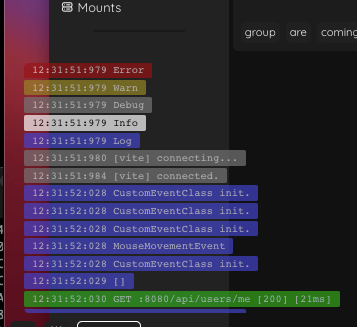

<div align="center">

  <h2>js-console-overlay</h2>
  <blockquote>An overlay console for your browser</blockquote>
<br/>
<a href="https://github.com/hodgef/js-library-boilerplate"></a>
</div>

## Description
A simple console overlay for your browser.

Usefull when you want to see the logs in a mobile browser while you are developping.

Or if you don't want to open the full-fledged console to display rare occurence of logs.

<div align="center">
  
</div>

## Features

- Display console Log, Error, Warn, Debug, Info messages
- Display Fetch request
- Customization 
  - Position
  - Size
- Auto-clear of old message

## Planned features
- XMLHttpRequest

## Usage

Simple download <a href="https://github.com/Sylrelo/js-console-overlay/raw/main/dist/js-console-overlay.min.js">js-console-overlay.min.js</a> and use it in your html file.

```html
<script src="js-console-overlay.min.js"></script>
```

You can set some options : 

```html
<script>
    // Those are the default value, you can set only the one you're interested with.
    overlayConsole.setOptions({
      // Max displayed messages
      maxMessage: 100,
      // Auto-hide delay in seconds
      autohideDelay: 10,
      // Position of the container
      // Possible values : BOTTOM-LEFT, BOTTOM-RIGHT, TOP-LEFT, TOP-RIGHT
      position: "BOTTOM-LEFT",
      // Left/Right margin in px
      offsetX: 20,
      // Top/Bottom margin in px
      offsetY: 40,
      // Max container height in px
      maxHeight: 200,
      // Max container width in px
      // 0 is equal to (100vw - offsetX)
      maxWidth: 0,
    })
</script>
```

A bookmarklet and userscript version will be made available.